### 🧠 Computer Vision

## 📌 Filters (Kernels)
Filters are small matrices applied to images to modify pixel values.

Common filters:
- **Blur / Smoothing** – Reduce noise
- **Sharpen** – Enhance edges
- **Edge Detection** – Detect object boundaries

## 📌 Convolution
Convolution is the process of:
1. Sliding a filter over an image
2. Performing element-wise multiplication
3. Summing values to produce a new pixel

This operation helps the model **learn visual patterns** such as edges and shapes.

Example kernel:

### 🛡️ Preventing Overfitting in Deep Neural Networks

Overfitting occurs when a model performs well on training data but fails to generalize to unseen data.  
The following techniques are commonly used to improve **generalization** in deep neural networks.

---

## 📌 Regularization
Regularization adds a penalty to large weights in the loss function to reduce model complexity.

Types:
- **L1 Regularization** – Encourages sparsity
- **L2 Regularization (Weight Decay)** – Prevents large weight values

**Benefit:** Controls model complexity and reduces overfitting.

---

## 📌 Dropout
Dropout randomly deactivates a fraction of neurons during training.

- Prevents neurons from co-adapting
- Forces the network to learn robust features

**Typical dropout rate:** `0.2 – 0.5`

---

## 📌 Early Stopping
Early stopping monitors validation performance and stops training when it starts to degrade.

- Prevents unnecessary training
- Avoids memorization of training data

**Common metric:** Validation loss

---

## 📌 Batch Normalization
Batch Normalization normalizes layer inputs during training.

- Stabilizes learning
- Allows higher learning rates
- Acts as a mild regularizer

**Result:** Faster convergence and improved generalization.

### 🔄 Transfer Learning

Transfer learning leverages knowledge from a **pretrained deep neural network** to solve a new but related task.  
It significantly reduces training time and improves performance, especially with limited data.

---

## 📌 Pretrained Embeddings
A pretrained model learns rich feature representations from large datasets like **ImageNet**.

- Early layers capture edges, textures, and shapes
- Later layers capture high-level semantic features

These learned features are reused as **embeddings** for new tasks.

---

## 📌 Fine-Tuning
Fine-tuning involves updating some or all layers of a pretrained model on the target dataset.

- Freeze early layers
- Train higher layers on task-specific data
- Optionally unfreeze and train the full network

**Benefit:** Adapts generic features to domain-specific patterns.

---

## 📌 Differential Learning Rates
Different learning rates are applied to different layers of the network.

- Lower learning rate → pretrained layers
- Higher learning rate → newly added layers

This prevents destroying learned representations while still enabling adaptation.

---

## 🖼️ Pretraining Dataset – ImageNet
ImageNet is a large-scale dataset commonly used for pretraining deep learning models.

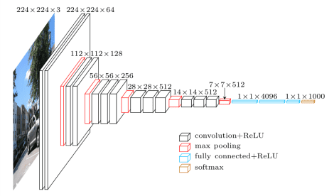

---

## ⚙️ Why Transfer Learning?
- Faster convergence
- Reduced overfitting
- Requires less training data
- Industry-standard practice in computer vision

---

### 🧠 AlexNet

AlexNet is a landmark **deep convolutional neural network (CNN)** that revolutionized computer vision by demonstrating the power of deep learning on large-scale image classification tasks.

---

## 🏆 ImageNet Achievement
- **Competition:** ImageNet Large Scale Visual Recognition Challenge (ILSVRC)
- **Year:** 2012
- **Result:** 🥇 **1st Place Winner**
- **Impact:** Reduced top-5 error rate by a significant margin compared to traditional methods

---

## 🎯 Purpose
- Large-scale **image classification**
- Learning hierarchical visual features from raw pixel data
- Proved deep CNNs outperform handcrafted features

---

## 💡 Core Ideas
- Deep CNN architecture
- Use of **ReLU** activation for faster training
- **Dropout** to reduce overfitting
- **Data augmentation** for better generalization
- GPU-based training

---

## 🏗️ Architecture Overview
AlexNet consists of **8 learnable layers**:
- **5 Convolutional layers**
- **3 Fully Connected layers**

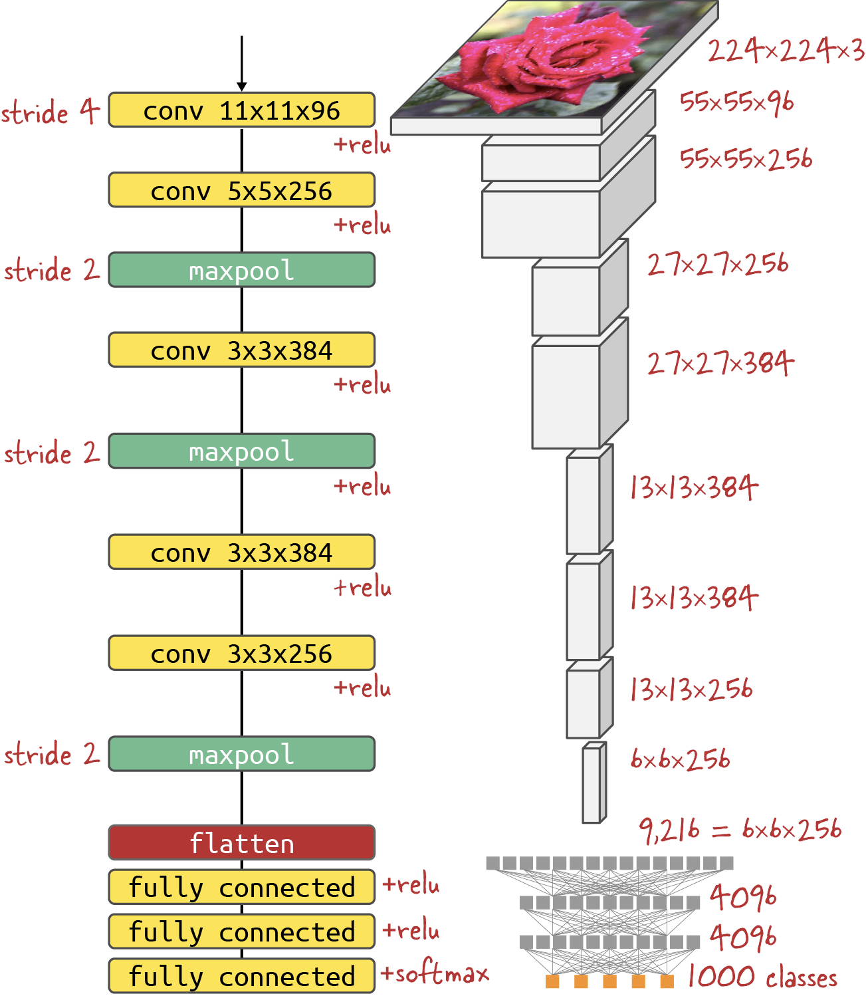

---

## 🔢 Model Details

| Property | Value |
|--------|------|
| Year | 2012 |
| Total Layers | 8 |
| Convolutional Layers | 5 |
| Fully Connected Layers | 3 |
| Activation Function | ReLU |
| Number of Parameters | ~60 million |
| Input Image Size | 227 × 227 × 3 |

---

## 🚀 Why AlexNet Matters
- Sparked the deep learning boom in computer vision
- Set the foundation for models like VGG, GoogLeNet, and ResNet
- Still used as a reference architecture in CNN studies

---
### 🧠 VGG (VGG-16 / VGG-19)

VGG is a deep convolutional neural network known for its **simple and uniform architecture**, using small convolution filters stacked deeply to achieve high performance in image recognition tasks.

---

## 🏆 ImageNet Achievement
- **Competition:** ImageNet Large Scale Visual Recognition Challenge (ILSVRC)
- **Year:** 2014
- **Result:** 🥈 **2nd Place (Classification)**
- **Note:** Did not win overall but became extremely popular due to architectural simplicity and effectiveness

---

## 🎯 Purpose
- Large-scale **image classification**
- Learning deep hierarchical visual features
- Serving as a strong **feature extractor** for transfer learning

---

## 💡 Core Ideas
- Use of **very small (3×3) convolution filters**
- Deep stacking of convolution layers
- Uniform architecture across the network
- Increased depth improves representational power

---

## 🏗️ Architecture Overview
Two popular variants:
- **VGG-16** → 16 learnable layers
- **VGG-19** → 19 learnable layers

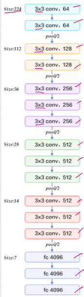

---

## 🔢 Model Details

| Property | VGG-16 | VGG-19 |
|--------|--------|--------|
| Year | 2014 | 2014 |
| Total Layers | 16 | 19 |
| Convolutional Layers | 13 | 16 |
| Fully Connected Layers | 3 | 3 |
| Activation Function | ReLU | ReLU |
| Number of Parameters | ~138 million | ~144 million |
| Input Image Size | 224 × 224 × 3 | 224 × 224 × 3 |

---

## 🚀 Why VGG Matters
- Demonstrated the power of **network depth**
- Simple, easy-to-understand CNN design
- Widely used in **transfer learning** and feature extraction
- Benchmark architecture for CNN studies

---

### 🧠 GoogLeNet (Inception v1)

GoogLeNet introduced the **Inception architecture**, enabling very deep networks while keeping computational cost low by using parallel convolution paths.

---

## 🏆 ImageNet Achievement
- **Competition:** ImageNet Large Scale Visual Recognition Challenge (ILSVRC)
- **Year:** 2014
- **Result:** 🥇 **1st Place Winner**
- **Impact:** Achieved state-of-the-art accuracy with far fewer parameters than VGG

---

## 🎯 Purpose
- Large-scale **image classification**
- Efficient deep feature extraction
- Reduce computation without sacrificing accuracy

---

## 💡 Core Ideas
- **Inception modules** with parallel filters (1×1, 3×3, 5×5)
- **1×1 convolutions** for dimensionality reduction
- Deep architecture with controlled parameter growth
- Global Average Pooling instead of fully connected layers

---

## 🏗️ Architecture Overview
GoogLeNet is composed of stacked **Inception modules** arranged in a deep network.

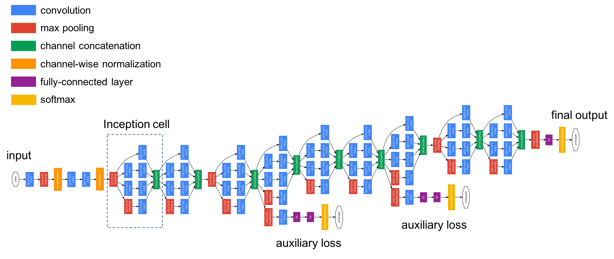

---

## 🔢 Model Details

| Property | Value |
|--------|------|
| Year | 2014 |
| Total Layers | 22 |
| Convolution Type | Inception modules |
| Fully Connected Layers | None (uses GAP) |
| Activation Function | ReLU |
| Number of Parameters | ~5 million |
| Input Image Size | 224 × 224 × 3 |

---

## 🚀 Why GoogLeNet Matters
- Much **lighter** than VGG with comparable or better accuracy
- Introduced modular CNN design
- Inspired later architectures like Inception-v3, v4, and Xception
- Highly efficient for real-world deployment

---

### 🧠 SqueezeNet

SqueezeNet is a lightweight convolutional neural network designed to achieve **AlexNet-level accuracy with dramatically fewer parameters**, making it suitable for deployment on resource-constrained devices.

---

## 🏆 ImageNet Achievement
- **Competition:** ImageNet Large Scale Visual Recognition Challenge (ILSVRC)
- **Year:** 2016
- **Result:** ❌ Did NOT win ImageNet
- **Achievement:** Achieved **AlexNet-level accuracy** with ~50× fewer parameters

---

## 🎯 Purpose
- Efficient **image classification**
- Model compression and deployment
- Suitable for **embedded systems** and edge devices

---

## 💡 Core Ideas
- **Fire modules** instead of traditional convolution blocks
- Use of **1×1 convolutions** to reduce parameters
- Delayed downsampling to preserve spatial information
- Compact architecture with high accuracy

---

## 🏗️ Architecture Overview
SqueezeNet is built using **Fire modules**, each consisting of:
- **Squeeze layer:** 1×1 convolutions
- **Expand layer:** 1×1 and 3×3 convolutions

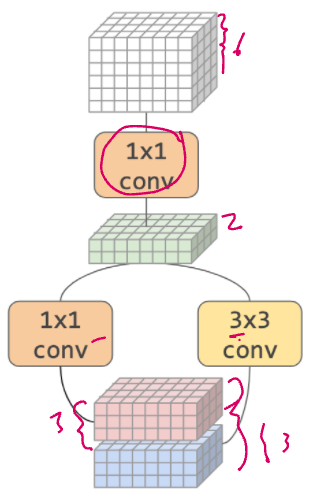
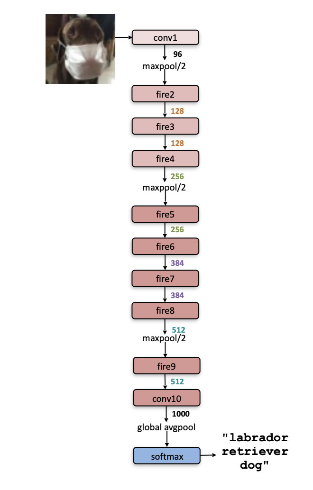

---

## 🔢 Model Details

| Property | Value |
|--------|------|
| Year | 2016 |
| Total Layers | ~18 |
| Core Block | Fire Module |
| Activation Function | ReLU |
| Number of Parameters | ~1.25 million |
| Model Size | < 5 MB |
| Input Image Size | 224 × 224 × 3 |

---

## 🚀 Why SqueezeNet Matters
- Extremely **parameter-efficient**
- Faster training and inference
- Ideal for low-memory environments
- Comparable accuracy to much larger models

---

### 🧠 ResNet (Residual Network)

ResNet introduced **residual learning**, enabling the training of extremely deep neural networks by solving the vanishing gradient problem.

---

## 🏆 ImageNet Achievement
- **Competition:** ImageNet Large Scale Visual Recognition Challenge (ILSVRC)
- **Year:** 2015
- **Result:** 🥇 **1st Place Winner**
- **Impact:** Achieved record-breaking accuracy with very deep networks

---

## 🎯 Purpose
- Large-scale **image classification**
- Training very deep CNNs effectively
- Learning robust hierarchical visual features

---

## 💡 Core Ideas
- **Residual (skip) connections**
- Learning residual mappings instead of direct mappings
- Easier gradient flow in deep networks
- Enables training of 100+ layer networks

---

## 🏗️ Architecture Overview
ResNet uses **residual blocks** with identity shortcut connections.

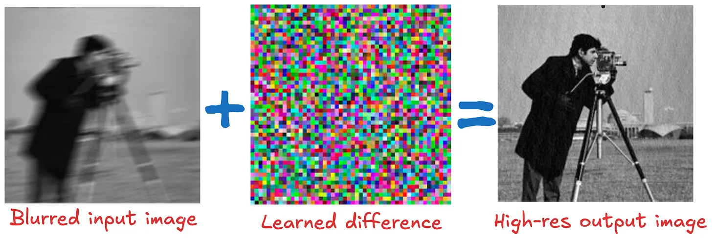
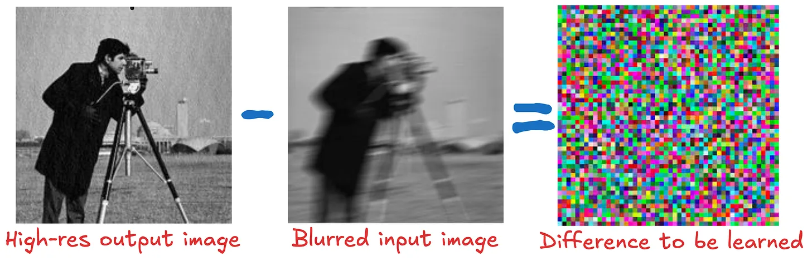
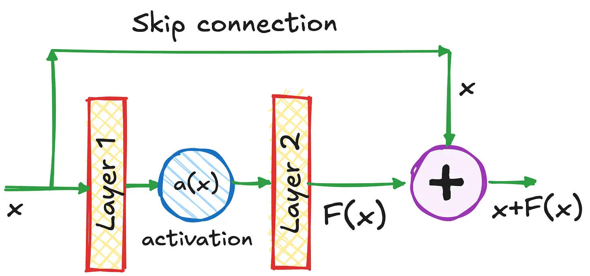

---

## 🔢 Model Details

| Property | ResNet-50 | ResNet-101 | ResNet-152 |
|--------|----------|------------|------------|
| Year | 2015 | 2015 | 2015 |
| Total Layers | 50 | 101 | 152 |
| Block Type | Bottleneck Residual | Bottleneck Residual | Bottleneck Residual |
| Activation Function | ReLU | ReLU | ReLU |
| Number of Parameters | ~25.6M | ~44.5M | ~60.2M |
| Input Image Size | 224 × 224 × 3 | 224 × 224 × 3 | 224 × 224 × 3 |

---

## 🚀 Why ResNet Matters
- Solved the **vanishing gradient** problem
- Enabled ultra-deep CNNs
- Backbone for many modern CV models
- Industry standard for vision tasks

---

### 🧠 MobileNet

MobileNet is a lightweight convolutional neural network designed for **mobile and embedded vision applications**, focusing on low latency and high efficiency.

---

## 🏆 ImageNet Achievement
- **Competition:** ImageNet Large Scale Visual Recognition Challenge (ILSVRC)
- **Year:** 2017
- **Result:** ❌ Did NOT win ImageNet
- **Achievement:** Achieved competitive accuracy with significantly reduced computation

---

## 🎯 Purpose
- Efficient **image classification**
- Deployment on **mobile and edge devices**
- Real-time computer vision applications

---

## 💡 Core Ideas
- **Depthwise separable convolutions**
- Factorization of standard convolution into:
  - Depthwise convolution
  - Pointwise (1×1) convolution
- Dramatic reduction in computation and parameters

---

## 🏗️ Architecture Overview
MobileNet replaces standard convolutions with **depthwise separable convolutions**.

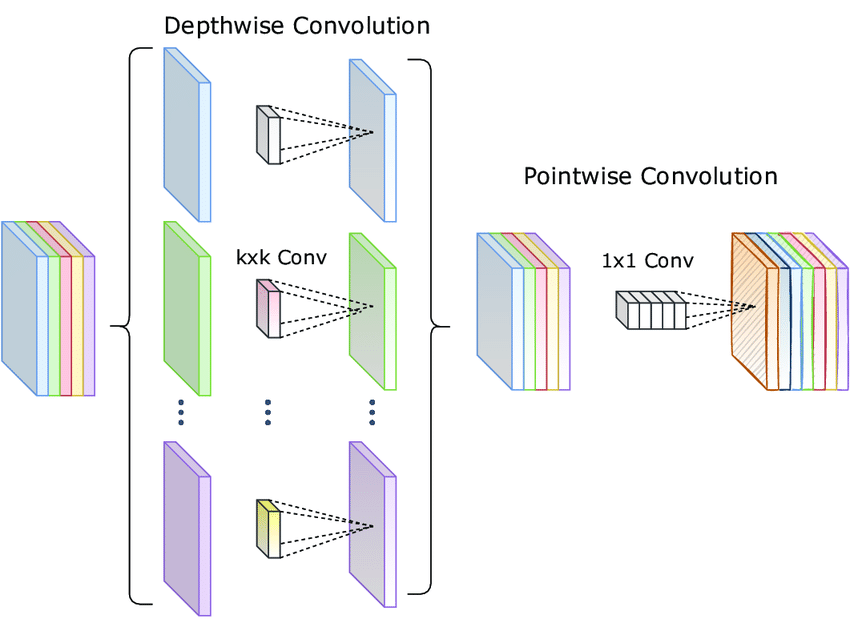
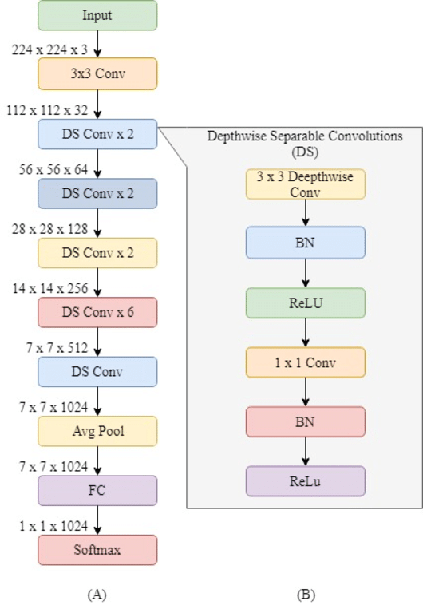

---

## 🔢 Model Details (MobileNet v1)

| Property | Value |
|--------|------|
| Year | 2017 |
| Total Layers | ~28 |
| Core Block | Depthwise Separable Conv |
| Activation Function | ReLU |
| Number of Parameters | ~4.2 million |
| Model Size | ~16 MB |
| Input Image Size | 224 × 224 × 3 |

---

## 🚀 Why MobileNet Matters
- Optimized for **speed and efficiency**
- Ideal for resource-constrained hardware
- Widely used in mobile AI applications
- Backbone for MobileNet v2, v3 and Efficient models

---

