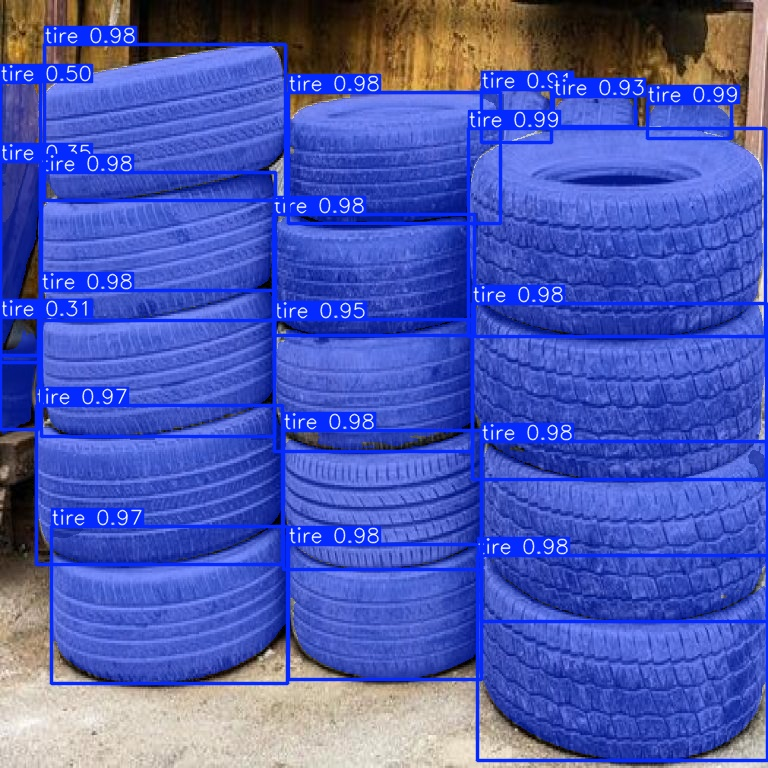

# 🚗 Tyre Segmentation & Counting Web Application

A full-stack **Computer Vision Web Application** that performs **tyre segmentation and counting** using a custom-trained **YOLOv8 Segmentation model**, deployed with a **FastAPI backend** and a modern **frontend UI**.  
The system supports **image and video inputs**, runs fully on **CPU**, and is designed for **free deployment environments**.

---

## 📌 Project Overview

This project detects, segments, and counts tyres in images and videos using deep learning.  
It is useful for:
- Road surveillance
- Vehicle analysis
- Smart traffic systems
- Industrial inspection use cases

### 🔑 Key Features
- Tyre **instance segmentation**
- Automatic **tyre counting**
- Confidence scores for each detection
- Image & video processing
- CPU-compatible inference
- REST API based backend
- Deployable on free hosting platforms

---

## 🧠 Tech Stack

### 🔍 Machine Learning
- Python
- OpenCV
- NumPy
- Ultralytics YOLOv8 (Segmentation)

### ⚙️ Backend
- FastAPI
- Uvicorn
- Python Multipart Upload
- CORS Middleware

### 🎨 Frontend
- HTML
- CSS
- JavaScript
- Fetch API

### 🚀 Deployment
- Backend: Render (Microservice)
- Frontend: Render Static Site / Netlify / Vercel

---

## 📊 Dataset Preparation

### 📁 Dataset Collection
- Images collected from:
  - Public datasets
  - Internet sources
  - Real-world traffic scenes
- Focused on **clear tyre visibility**

### 🏷 Annotation
- Tool used: **Roboflow / CVAT / LabelMe**
- Annotation format: **YOLOv8 Segmentation**
- Each tyre annotated with:
  - Polygon mask
  - Class label (`tyre`)

### 📄 YOLOv8 Format
- image.jpg
- image.txt → class_id x1 y1 x2 y2 x3 y3 ...

---

## 🔄 Data Augmentation

Applied to improve generalization:
- Horizontal flip
- Vertical flip
- Rotation
- Scaling
- Brightness & contrast variation
- Blur & noise injection

These augmentations help the model handle:
- Different lighting conditions
- Camera angles
- Motion blur

---

## 🤖 Model Details (YOLOv8 Segmentation)

- Model: **YOLOv8-seg**
- Task: Instance Segmentation
- Backbone: CSPDarknet
- Head: Segmentation head with mask prediction

### 🏋️ Training Configuration
| Parameter | Value |
|---------|------|
| Epochs | 100 |
| Image Size | 640 |
| Batch Size | 8 |
| Optimizer | AdamW |
| Confidence Threshold | 0.25 |

---

## 🎯 Hyperparameter Tuning

Tuned parameters:
- Learning rate
- Batch size
- Image resolution
- Confidence threshold
- IoU threshold

## 🖼 Image Output Examples

  

